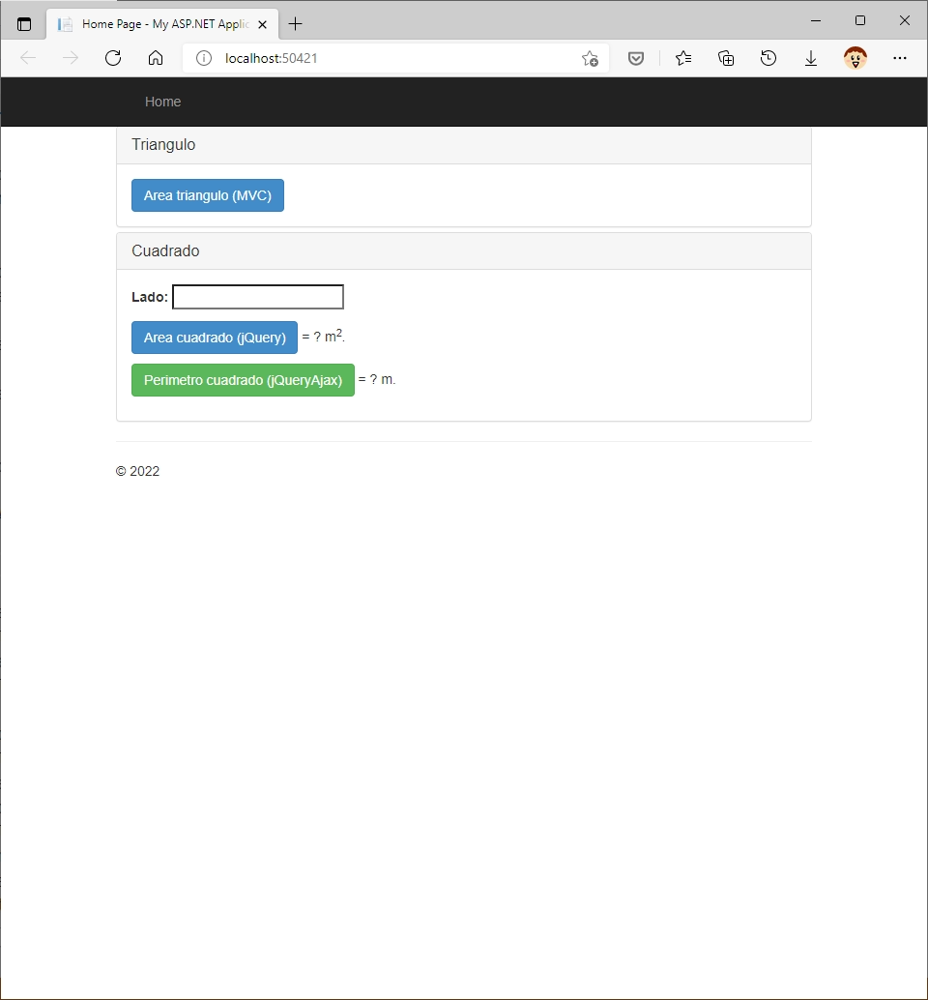

# Instrucciones para resolver la prueba técnica

Para resolver la prueba técnica, es necesario una versión de Visual Studio 2019 o superior,
preferiblemente sobre Windows 10 (aunque Windows 7 debería funcionar), con el soporte para desarrollo web con C# activado.

La duración estimada de la prueba es de 30 minutos, aunque podría prolongarse más tiempo si es necesario o se 
encuentran dificultades durante la resolución de la prueba.

Ésta consiste en completar el programa que se implementa en el proyecto, terminando tres funcionalidades diferentes de una aplicación MVC (ya construida). 
Dentro de la solución, hay un proyecto web que se puede ejecutar sin errores tal cual se encuentra (sin ninguna modificación en el código). 
Todas las dependencias del proyecto se encuentran también incluidas en la solución (tanto las de la parte de servidor como las de la parte de cliente) y 
no ha de ser necesario incluir ninguna más.

Al ejecutar el proyecto desde Visual Studio, debe aparecer en el navegador web una pantalla como ésta:

La prueba se divide en tres partes, una por cada una de las funcionalidades a resolver. Cada una de ellas, se relaciona con uno de los botones de la imagen:

1. Al pulsar el botón ``Area triángulo``, debería mostrarse una página *(ya está implementada)* con un formulario de entrada *(no está implementado)* 
   que solicite los datos necesarios para el cálculo del área de un triángulo. 
   Al pulsar el botón de envío de la página *(está implementado parcialmente)*, 
   **el servidor tiene que resolver el área del triángulo** con los datos del formulario como entrada **y mostrar**, en la misma página, 
   **el resultado del cálculo**. 
   Se espera que la solución sea exclusivamente en C# con Microsoft MVC y Razor (es decir, nada de Javascript en este caso). 
   También se valorará positivamente que el código resultante sea idiomático, cercano a cualquier ejemplo de MVC que pudiera encontrarse 
   en la documentación de Microsoft. Los sitios donde debe aparecer el código aportado están marcados con un comentario.
1. El segundo botón ha de resolver el área de un cuadrado, tomando como valor del lado del cuadrado el que se haya escrito en el campo de entrada 
   que aparece en la pantalla. El valor de resultado calculado debería reemplazar al caracter ``?`` a la derecha del botón. 
   En este caso, **la solución debe existir exclusivamente en lado de cliente** (y **es preferible, aunque no imprescindible, 
   que se utilice jQuery**, que ya está disponible en la página existente). 
   Deben seguirse las indicaciones que hay en los comentarios del código y usar las funciones que se proporcionan cuando sea posible.
1. Finalmente, tomando como valor de entrada el obtenido de la misma caja de texto que en el paso 2, 
   se espera que la pulsación del tercer botón (``Perímetro cuadrado``) realice una llamada AJAX desde el cliente con el valor de entrada, 
   de forma que sea el servidor el que realice el cálculo (vea ``MathController.cs``). 
   La respuesta del servidor se procesará en el lado de cliente para reemplazar el ``?`` a la derecha del botón.

**Se valorarán tanto el buen funcionamiento de la solución aportada, así como características del código** aportado 
(cumplimiento de las convenciónes de nombres de .Net, uso de mecanismos estándar, limpieza del código, etc.), siempre teniendo en cuenta
que se trata de una prueba de corta duración.

En todas las respuestas, donde tenga sentido, **se valorará positivamente el uso de Bootstrap** (que también está ya incluido en la solución), 
**aunque no es un requisito** (si no se conoce, no es necesario usarlo).

Tomando el estado inicial de la solución, debería poder resolverse la prueba sin necesidad de cambiar código más que en las carpetas Models, Views y Controllers, 
pero si se considera oportuno, puede modificarse la estructura del proyecto a conveniencia (siempre que se justifique).

Dentro de la solución hay un archivo ``NOTAS.TXT``. En este archivo, puede anotarse (brevemente) cualquier tipo de observación que se considere 
oportuna para el evaluador (explicar las decisiones que ha tomado en la resolución de la prueba, comentar posibles mejoras a la solución, etc.)

